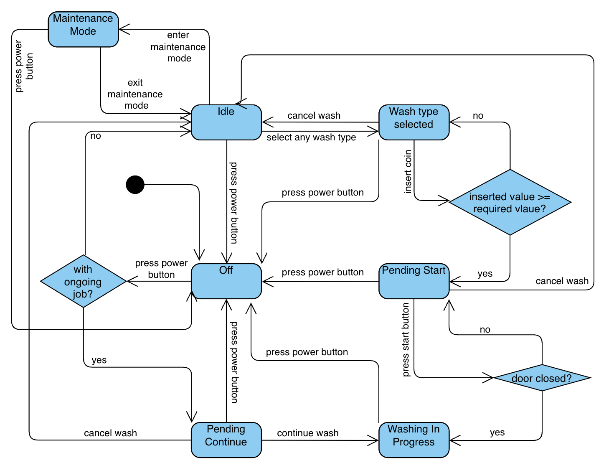

# Washing Machine app
The Washing Machine App is a simulation application designed to replicate the functionality of a washing machine system typically found in laundromats. 

## Running the app:
To run the Washing Machine App on your machine, follow these steps:
1. Download the repository or use Git to clone it onto your local machine.
2. To start the app, navigate to the `/laundromat` directory in your terminal or command prompt and run `docker-compose up -d --build` command
3. To access the app frontend, open your web browser and navigate to localhost:3000
4. To access the app backend, open your API testing tool such as Postman, send requests to localhost:8080 to interact with the backend API.
5. To stop the app when you're finished using the app, navigate to the `/laundromat` directory in your terminal or command prompt and run `docker-compose down` command

## Demo
Refer to the [walk-thorugh](./demo/walk-through.md) for a visual walkthrough of the application's user interface and functionality.

## API documentation
Refer to the [postman api documentation](https://documenter.getpostman.com/view/11989182/2sA3Bt19WH) for more detailed information, you may also import the [postman collection file](./washine_machine_api.postman_collection.json) to send request to the backend server

## Features
- Accept coins of 10 cents, 20 cents, 50 cents and 1 dollar.
- Allow user to select different types of washing types.
  - Quick Wash (10 minutes - $2)
  - Mild Wash (30 minutes - $2.50)
  - Medium Wash (45 minutes - $4.20)
  - Heavy Wash (1 hour - $6)
- Before the washing job starts:
  - Allow user to take refund when cancelling the washing request.
  - Prompt the user if it is insufficient for the washing job.
  - Refund the user if there is excess for the washing job.
- Start, During or Completion of the washing job:
  - Lock or unlock the washing machine door during start or completion.
  - Update the user on the current progress of the washing job by Percentage and Remaining Time.
- Maintenance:
  - Display quick statistics on the washing machine.
    - Total time switched on.
    - Amount of money earned since in service or reset.
  - Allow reset operation for the statistics for washing machine owner.

## Finite State Machine

    

### State description
- Power off can happen at any state except for power off (to simulate normal power off, cut off power supply and power outage in real life context)
  - door can not be opened if there is ongoing job
  - inserted coin will be returned to user if any
  - Once the washing is switched on, it will check if the washing machine has ongoing job
    - goes to Idle state if no ongoing job
    - goes to Pending Contiune state if there is ongoing job (usually happens when accidental power off the washing machine in real life context)
- In Idle state, user can: 
  - enter Maintenance Mode state to view the statistics like total earning and total time switched on (washing) since the last reset
  - select any available wash type 
- Once user selected a wash type, the washing machine is in the Wash Type Selected State, user can:
  - choose to insert coin until the inserted amount is more than required amount
  - cancel job to go back Idle state, any inserted amount will be returned to user
- After user inserted enough coins, the washing machine is in pending start state, user can:
  - close the door and start job to enter Washing In Progress state, any excess amount will be returned to user, inserted amount is now zero
  - cancel job to go back Idle state, any inserted amount will be returned to user
- In the Washing In Progress state, the remaining job percentage and timing will be displayed (updated every 10 second / upon refresh), door cannot be opened
- When the job is completed, the washing machine will return to Idle state and door can be opened again
- In Maintenance Mode state, user can view the washing machine statistics and:
  - reset statistics
  - exit maintenance mode
- In Pending Continue state, user can:
  - choose to continue the wash job and go back to Washing In Progress state
  - cancel job and go back to Idle state, no refund is given here, this wash job is saved and the time used and earning will be reflected in the statistics