# Basic workflow
## Power Off

    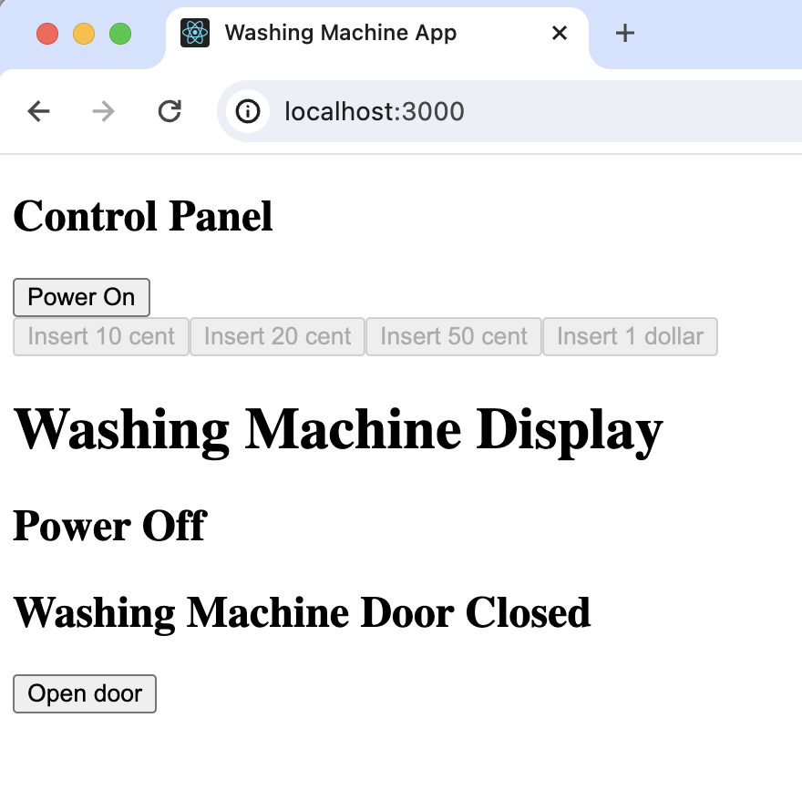

Initial state, nothing is displayed, coins selection disabled, can open or close door
  
Turn on the power will enter Idle state

## Idle

    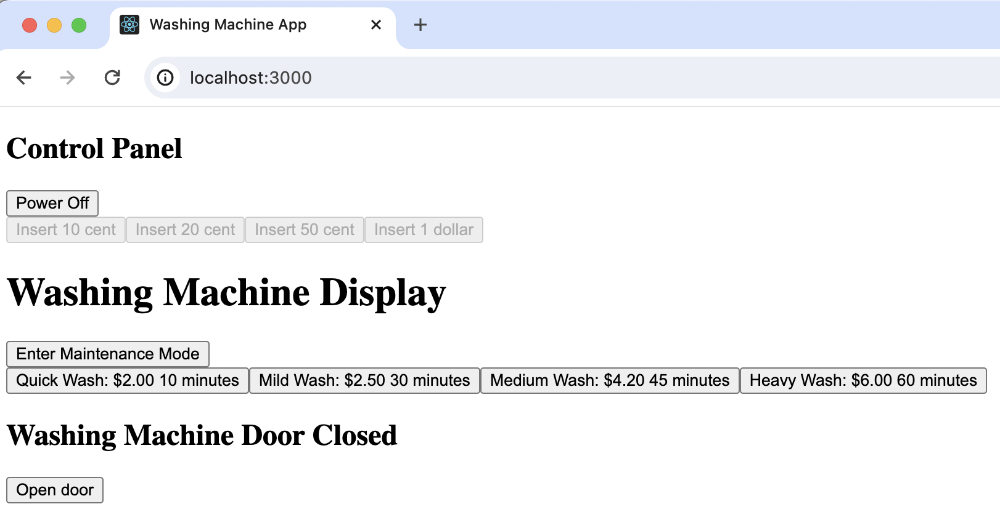

User can select any wash type or enter maintenance mode 

## Wash Type Selected

    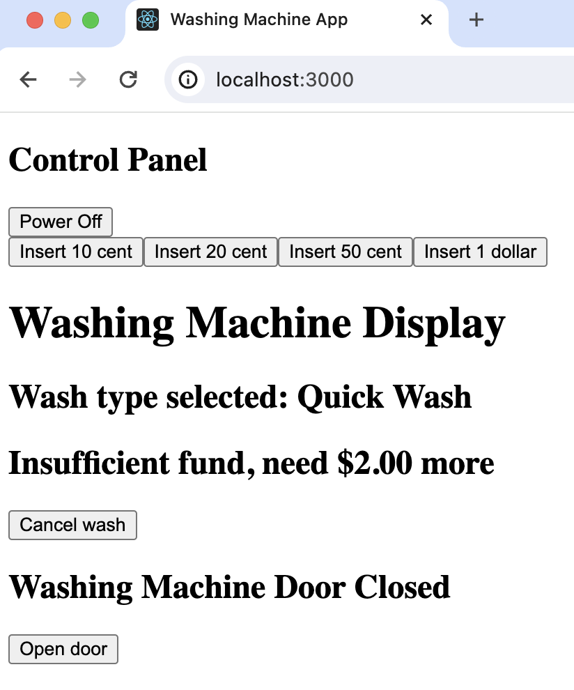

Display the selected job name and remaining fund required
  

    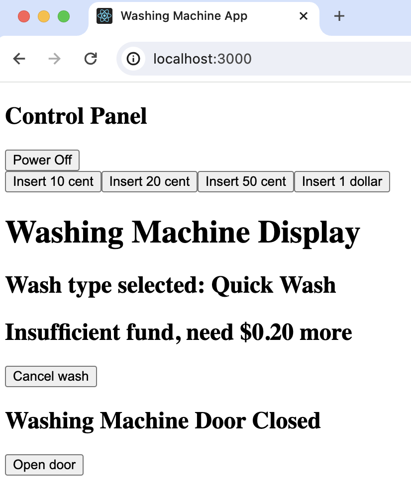

Remaining value updates when coins are inserted

## Pending Start

    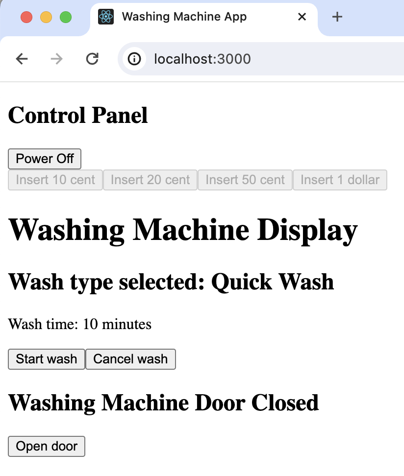

Display the selected job name and time required, can start or cancel

## Washing In Progress

    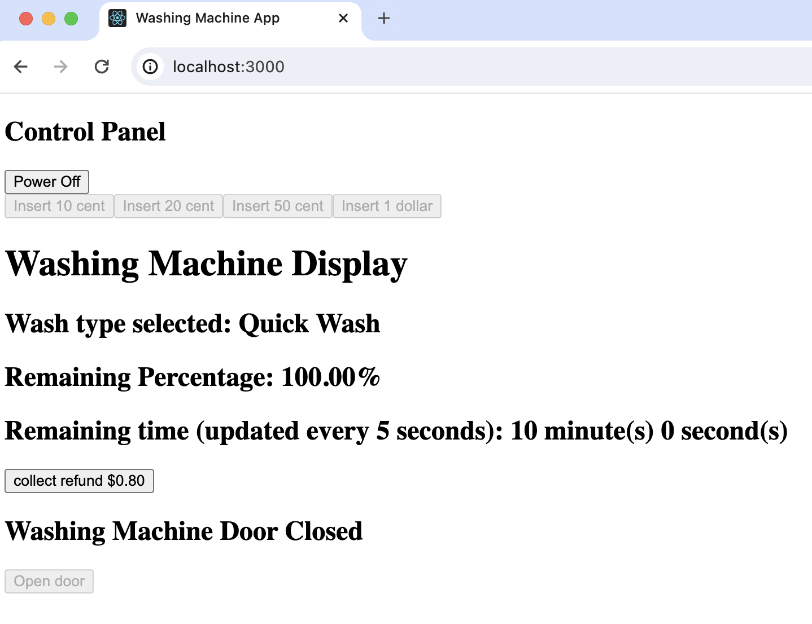

Display the wash job progress, door is locked, display refund value and ask user to collect

## Maintenance Mode

    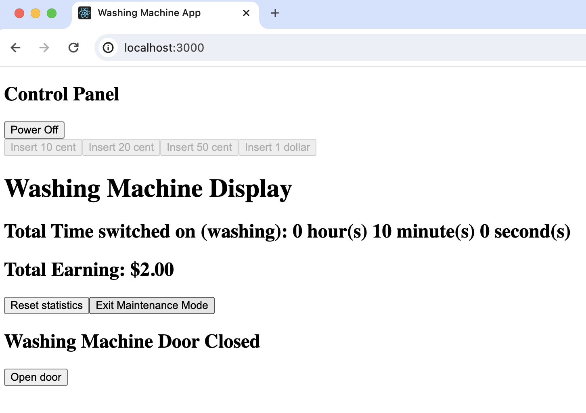

Check stats after wash job completed
  

    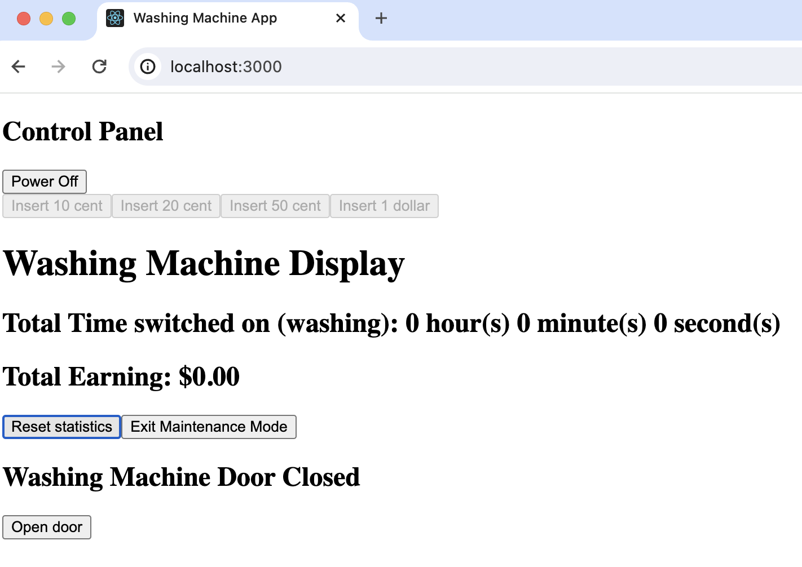

Statistics updated after reset

## Pending Continue
Turn off the washing machine when there is ongoing job

    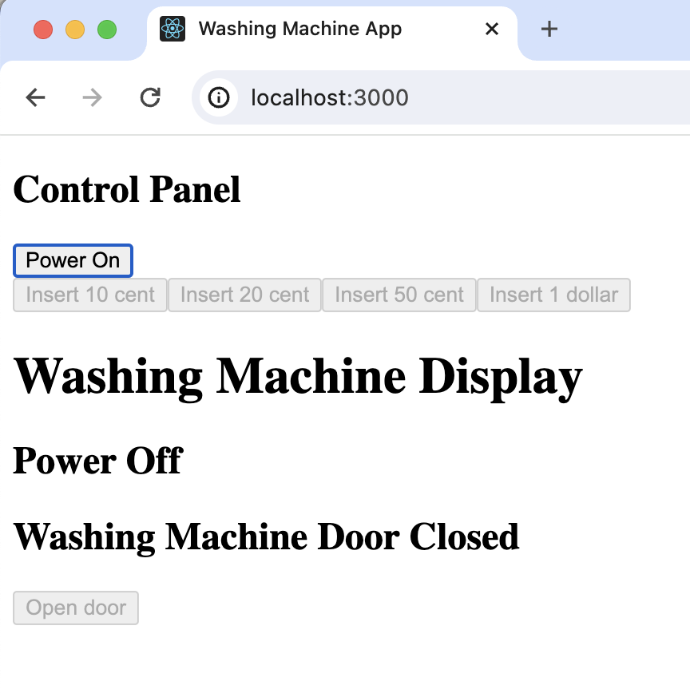

The door is still locked
  
Turn on the power again and it will display pending continue page
  

    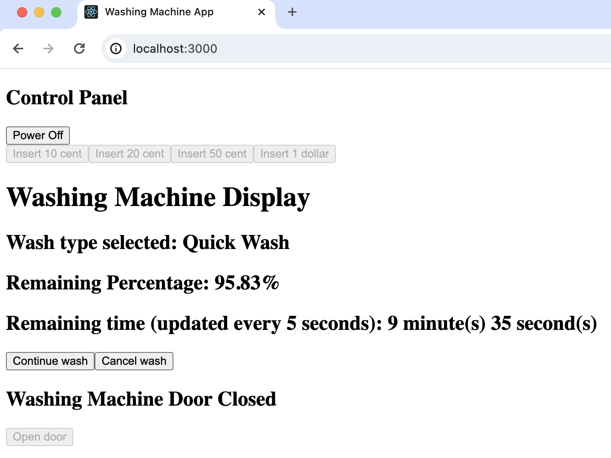

User can choose to continue wash job or cancel wash job to go back idle state
  

    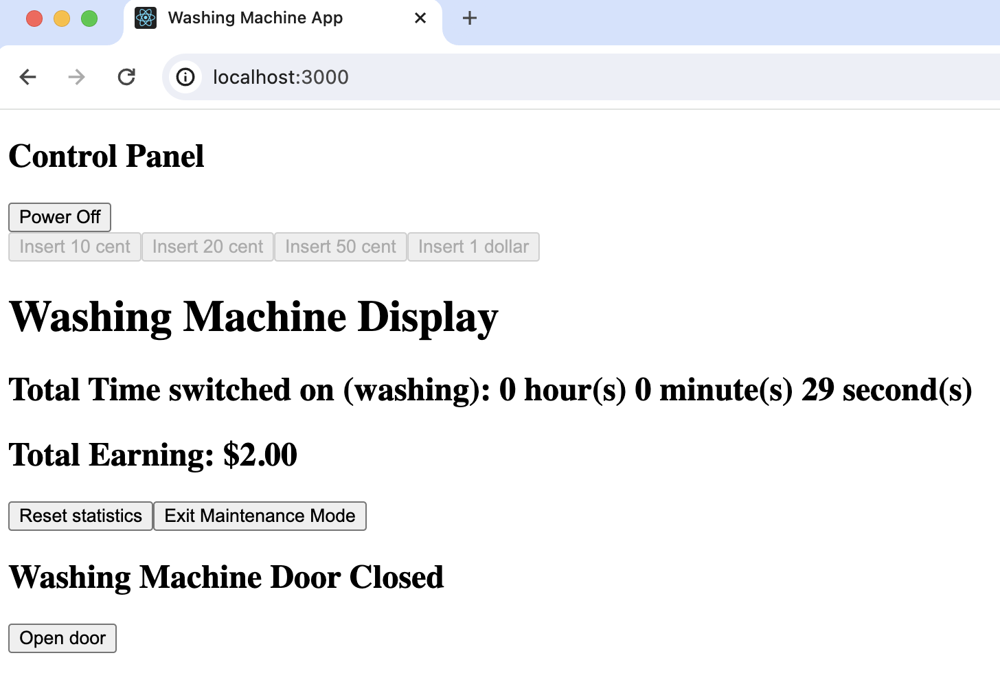

The time spent in the cancelled job is added too

# Other cases
## If door is open when trying to start a wash job 

    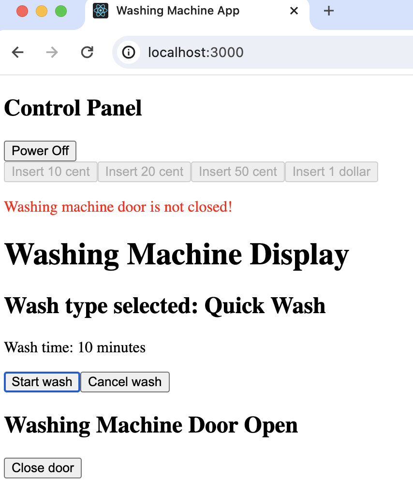

Prompt the user to close the door for 10 seconds or until user close the door, whichever is earlier

## Cancel a wash job before start washing

    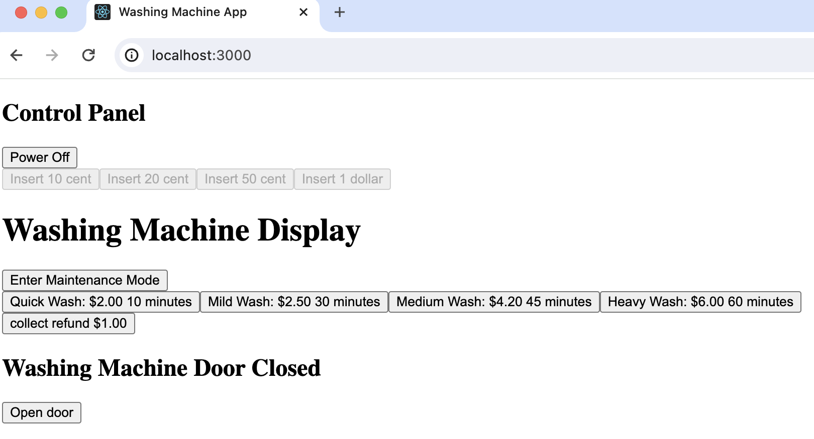

Display refund value and ask user to collect

## Power off after inserting coins and before start washing

    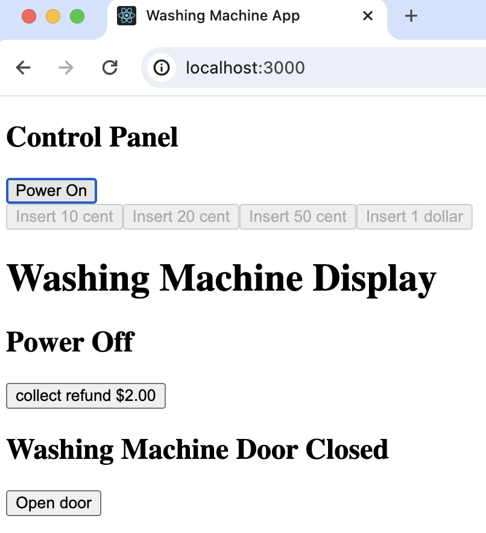

Display refund value and ask user to collect
